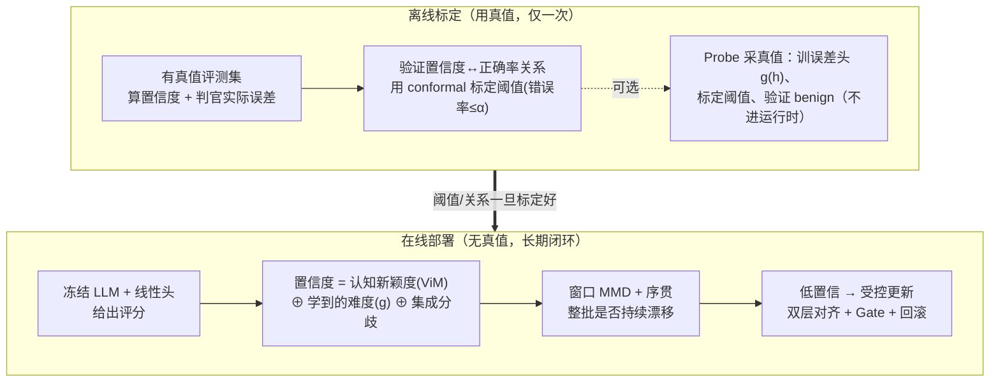

# 表征即判官 + OOD 监控：完整方案总览

> 本文只讲**方法与设计逻辑**，不写具体实验数字，也不写各章节当前的通过/待办状态。
> 具体结果见 `待完善汇报结果.md`，完整证据链与通过条件见 `LLM_Judge_OOD_完整证据链与实验执行方案.md`。
> 文末"参考文献"列出已核实的外部方法来源；未列出的方向性提法待正式投稿时补精确引用。

---

## 0. 一句话概览

我们要在小 LLM 表现不好的 "LLM-as-a-Judge"（用 LLM 给别人的答案打分）任务上，
**不通过微调 LLM 本体、而是冻结 LLM、只训练一个轻量分类头**来恢复评分能力；
再把 LLM 的内部表征当作分类器输入，构造一个**能预测"判官这次靠不靠谱"的置信度**，用它无标签地监控判官、并在需要时受控地更新。

**本方法的核心贡献（也是与 fine-tune 派的根本区别）**：

> 我们把"判官何时失效"变成一个**可以无标签预测、且带先验保证**的量。
> fine-tune 派在新分布上"泛化成没成"要等真值才知道；我们用"认知新颖度 + 学到的难度"两类信号构造置信度，
> 再用 **conformal 风险控制**给出"选择性评分错误率 ≤ α"的先验保证，
> 低置信度就受控地**只更新一层轻量对齐结构**去 adapt 新分布。

方法链（离线证明/标定一次，在线长期 label-free 应用）：

---

## 1. 动机与核心假设

### 1.1 问题

用小 LLM（如 4B 量级）直接做 Judge，在长报告评价、细粒度评分这类任务上打分不稳定：既不稳、又常常系统性偏高或与人类/教师分数对不上。

### 1.2 常见做法及其风险

常见解法是**微调 LLM**（SFT/LoRA）去提升评分。但这会引入 **OOD（分布外）问题**：

- 微调用的数据集 **A** 和真实上线要评的数据集 **B**，往往不是同一个 domain 或同一种评分任务。
- LLM 自身带有 world knowledge，**也许**能泛化到 B，**也许**不能。
- 关键困境：**上线时我们没有 B 的真值标签，无法直接知道判官在 B 上到底泛化成功了没有。**

也就是说，微调本身不是问题，**"不知道它在新分布上还灵不灵"才是问题**。

### 1.3 我们的假设

受 Representation-as-Judge 一类工作的启发：**冻结 LLM、只在其表征上训练一个分类头，往往比让 LLM 直接生成分数更好。**

- **H1（能力假设）**：LLM 内部表征里本就含有可用的评分信号，直接生成分数没稳定利用它。冻结 + 轻量头能把它提取出来。
- **H2（监控假设）**：既然判官就是"表征 → 分类头"，那么可以在表征空间上构造一个置信度来无标签地预测判官何时失效、何时需要 adapt。

### 1.4 相较 fine-tune 派的优点

| | fine-tune 派 | 本方法 |
|---|---|---|
| 提升评分 | 微调整个 LLM | 冻结 LLM，只训线性头（更省、不破坏表征几何） |
| 上线后是否知道判官失效 | **不知道**（要真值才知泛化成没） | **无标签可预测 + conformal 先验保证** |
| 何时该更新 | 靠人拍脑袋 / 定期重训 | 置信度低于标定阈值自动触发 |
| 更新代价 | 重新微调 LLM | 只更新一层轻量对齐结构 + Gate 把关 |

### 1.5 两个必须分开的概念

| 概念 | 定义 | 由谁回答 |
|---|---|---|
| **OOD（是否偏移）** | 新样本/新窗口是否落在判官训练分布之外 | ViM / MMD（无需真值） |
| **Harmful（是否有害）** | 偏移是否真的让判官打分误差上升 | 由置信度无标签预测（离线用真值标定一次） |

分布变了 **不等于** 判官变差了。本方法的关键正是：**先离线证明/标定"置信度能预测 harmful"，之后就用置信度代替真值来判**。

---

## 2. 核心贡献主线：一个能预测判官正确率、且带先验保证的置信度

这是全篇支点，其余模块都是它的下游应用，所以放在最前面。

### 2.1 为什么"纯用 ViM 距离当正确率"不够牢

一个直觉是：直接拿 ViM 的 OOD 分数当"判官会不会错"的代理。但这有**方法论级的漏洞**：ViM 度量的是**样本到训练支撑集的新颖度（covariate novelty / 认知不确定性）**，它**从来不是误差**，也从没在"预测正确率"上训练过。因此有两个系统性盲区：

- **benign-OOD**：样本很新颖（高 OOD 分），但判官照样判对 → 会虚报。
- **hard-ID**：样本就在分布内（低 OOD 分），但判官判错（难样本）→ **纯距离完全看不见这类错误**。

所以"距离高 = 会错"只能**事后**拟合相关性，**无法先验保证**。这个观察本身就是我们的一个 insight，并直接决定了下面的设计。

### 2.2 修法：置信度 = 三条互补的腿

不把宝押在单一距离上，而是融合三类信号，各自补对方的盲区：

| 腿 | 信号 | 度量什么 | 补哪个盲区 | 需要真值？ |
|---|---|---|---|---|
| ① **认知新颖度** | ViM 残差 `‖h⊥‖₂` | 离训练支撑多远（epistemic） | benign 侧的"没见过" | 否 |
| ② **学到的难度** | source 上训的误差头 `g(h)→P(判官答错)` | 判官在这类样本上历史多容易错 | **hard-ID** | 训练时用（离线一次） |
| ③ **无标签准确率估计** | 集成分歧 / agreement-on-the-line / ATC | 一批数据上判官的整体准确率 | 群体层面的漂移 | 否（部署时） |

- **①的先验角色被收窄到它真正能声称的**："落在训练支撑之外 ⇒ 认知上不可信"——这是先验成立的，而不是"距离=错误率"那种越界断言。
- **②直接为目标量训练**：`g(h)` 就是拿 source 真值训"判官会不会错"，所以它能看见 hard-ID，是对①的正面补强，而非借距离。
- **③给群体层面的无标签核对**：多头集成分歧捕捉认知不确定性 [Deep Ensembles]；agreement-on-the-line 与 ATC 能**无标签估计新测试集准确率**，作为窗口级触发的旁证。

### 2.3 先验保证：conformal 风险控制（正面回应"无法先验保证"）

无论用①②③哪种分数，都可以套一层 **conformal risk control**：把该分数当 nonconformity score，在离线校准集上确定阈值，即可得到**有限样本、分布无关**的先验保证，例如：

> "被系统判为高置信的评分，其错误率 ≤ α，置信度 1−δ。"

这把"祈祷相关性高"换成了"保证选择性评分风险 ≤ α"。在协变量漂移下（正是我们的 OOD 场景），用 **weighted conformal**（按似然比 `p_test/p_train` 加权）恢复覆盖有效性。**这层保证是先验的、不依赖事后观察相关性**。

### 2.4 相关性的正确定位

在此框架下，"ViM 分数 vs 判官误差的相关性"从**唯一机制支柱**降级为**分析与验证**：我们仍会离线报告它（分数分箱 vs 实际正确率、分数对"判官答错"的 AUROC、bootstrap CI），但它只是证据之一，真正给保证的是 conformal，真正补盲区的是 `g(h)` 与集成。

### 2.5 这套设计有成熟范式支撑

"离线标定某置信统计量 → 在线无标签套用"是被反复验证的方向：selective / failure prediction、OOD detection 的 AUROC 评测范式、以及分布漂移下无标签估计准确率（ATC、agreement-on-the-line）。见参考文献。

### 2.6 应用侧：选择性评分与成本感知路由

置信度一旦可信，就能做**选择性评分**：高 OOD/低置信样本可弃权、标"需复核"、或**路由到更大的模型**去评，实现成本感知部署——小模型判高置信的多数，大模型只兜底少数难/新样本。

### 2.7 诚实边界

三条腿 + conformal 也不等于万能：conformal 的保证依赖校准集与似然比估计的质量；`g(h)` 只能覆盖 source 见过的错误模式。本方法主张**强且带保证的代理**，而非**真值的完全替代**；高风险场景可选保留极轻量人工抽检作审计，但**不进核心闭环**。

---

## 3. 研究问题（方法导向）

- **RQ1**：冻结 LLM、只训线性头，能否在 ID 测试上明显优于"LLM 直接生成分数"和平凡基线？（验证 H1）
- **RQ2**：ViM 类 OOD 分数能否识别判官未见过的 domain / task / 二者同时变化的样本？
- **RQ3**：单样本置信度能否聚合成"整批是否持续漂移"的窗口级判断？
- **RQ4（核心-度量）**：**三条腿融合的置信度是否显著优于单一 ViM 距离？它能否覆盖 hard-ID 盲区？conformal 的先验风险保证是否在漂移下成立？**
- **RQ5（核心-更新）**：**低置信触发后，双层对齐 / 无标签测试时自适应能否修复 head-only 修不动的 far-shift，并被 Gate 安全把关？**

---

## 4. 方法总链（整体视角）

系统分为**离线标定层**（用真值、只做一次）和**在线闭环层**（无真值、长期运行）。

| 层 | 输入 | 输出 | 回答的问题 | 用不用真值 | 模块 |
|---|---|---|---|---|---|
| **离线标定** | 有真值评测集 | 误差头 g(h)、conformal 阈值、置信度↔正确率关系 | 分数能不能预测对错？阈值/保证定在哪？ | **用（仅一次）** | 第2节 + M1 + Probe |
| **在线检测** | 冻结表征 | 单样本置信度、窗口漂移判定 | 这次打分靠谱吗？整批是否持续漂移？ | 不用 | M1 M2 M3 M4 |
| **在线更新** | 低置信 + (少量或零)标注 | 更新后的对齐层（或回滚） | 怎么修？修完能否安全上线？ | 更新时才用少量标注（L2 可零标注） | M5(定位) M6 |

设计原则：**能不用真值的都不用**。真值只花在离线标定一次、以及更新时给新数据打少量标；运行时检测与触发完全 label-free。

---

## 5. 各模块具体说明

> 每个模块统一按：**做什么 / 输入输出 / 为什么这样设计 / 小例子**。

### M1. 冻结 LLM + 线性判断头（Representation-as-Judge）

**做什么**：冻结整个 LLM 全部参数，只在某一层 hidden state 上训练一个带 L2 正则的线性分类头输出评分。

**输入输出**：输入 `instruction + reference + rubric + scoring guide + candidate response` 拼成的评分 prompt，取隐藏层表征 `h`；输出 `ŷ = LinearHead(h)`。

**为什么这样设计**：
- **冻结**：保留 LLM 的 world knowledge 与表征几何，不被小数据微调破坏；后续 OOD 度量依赖的分布几何保持稳定。
- **只用线性头**：线性头恢复评分能力的同时**保留表征空间原有的 OOD 结构**。更强的非线性头（MLP）可能把 ID 评分再抬一点，却会把输入压进"利于分类、不利于分布比较"的空间，**破坏 OOD 几何**——判官分更准了，但再也分不清什么是 OOD。判断头必须同时服务"评分"和"当 OOD 度量输入"两个目标。

**小例子**：同一段候选回答，直接问 LLM"给几分"忽高忽低；冻结它、只训线性头去读内部表征，评分更贴合人类/教师分数——说明"会打分"的信息本就在表征里。

---

### M2. 双空间表征 A / B（协变量漂移 vs 概念漂移、无标签区分 benign/harmful）

**做什么**：对每个样本抽两种表征。
- **A-space（response 空间）**：只喂候选回答 `{candidate_response}`，反映"内容长什么样"。
- **B-space（judge-input 空间）**：喂完整评分 prompt，反映"判官在这个评分任务下怎么看它"。B-space 与直接评分用**完全相同的 prompt**。

**输入输出**：一条 response 只产生一条 A；同一 response 在 N 种 rubric 下评分则产生 1 条 A、N 条 B。

**为什么这样设计**：两类漂移需要不同空间来抓，双空间也让 benign/harmful 无需真值就能区分：

| 情形 | A-space | B-space（判官空间） | 无标签判读 |
|---|---|---|---|
| 换 rubric/评分语义变（**概念漂移**） | 不变 | 变 | 由 B 抓到 |
| 换内容但判官仍准 | 变（**协变量漂移**） | 残差基本不变 | **benign** |
| 内容变且判官打偏 | 变 | 变、置信度掉 | **harmful** |

**小例子**：同一篇报告先用"事实性"再用"完整性"评——内容没改，A 应逐位相同、只有 B 变。若某批新文档 A 明显漂移、但 B 残差几乎不动 → benign，不必重训；A、B 都漂且置信度下降 → harmful，进更新链。

---

### M3. 单样本置信度：ViM 认知新颖度 + 监督误差头

**做什么**：对每个样本表征，算出第 2 节定义的置信度。这是全链的核心度量。

**两个并列信号**：
- **ViM 残差（认知新颖度）**：用训练集表征估计一个**主子空间（principal space）**，把新样本表征 `h` 分解为"主子空间内成分"和"垂直残差 `h⊥`"，用残差范数 `‖h⊥‖₂` 度量新颖度 [ViM]。见过的样本几乎全落在主子空间里、残差小；没见过的冒出较大残差。**用 Residual-only（不掺 logits）**：判官在 OOD 上仍可能自信输出大 logits，融进去会掩盖残差里清楚的异常信号；且同一套残差几何能一路复用到窗口 MMD 与聚类。
- **监督误差头 `g(h)`**：在 source 真值上直接训"判官会不会答错"，补 ViM 看不见的 **hard-ID** 盲区。

两者（可再加集成分歧）融合，并可套 conformal 得到带保证的置信度。

**小例子**：判官在科技类报告上训练。一篇法律合规文档 → ViM 残差大（新颖）；一篇看似普通但含隐蔽事实陷阱的科技短文 → ViM 残差小、但 `g(h)` 预测"容易错" → 靠第二条腿救回。

---

### M4. 窗口漂移检测 + 序贯持续性

**做什么**：单样本置信度会抖，把最近一批样本聚成窗口，判断整个窗口是否相对源分布漂移，再判断是否持续。这一步把单样本信号聚合成"整批是否需要重训"。

**输入输出**：输入窗口内所有样本的残差向量；输出漂移置换 p 值 + "是否连续多窗漂移"的持续性判定。

**两个组件**：
1. **block-permutation MMD（是否漂移）**：MMD 度量"源参考集"与"当前窗口"的整体差异。先算真实差异 `T_obs`，再反复随机打乱两组身份标签重算，看多少次 ≥`T_obs` → **置换 p 值**。窗口检测用**完整残差向量**而非 norm：漂移关键在"残差朝哪些方向变了"，压成 norm 会丢方向信息。（可选：agreement-on-the-line/ATC 在窗口上给无标签准确率估计作旁证。）
2. **有限 horizon 序贯（是否持续）**：要求连续若干窗口都漂移才确认，滤掉单窗突发与交替抖动；用 alpha-spending（Pocock 类）控制整个监控生命周期的总误报预算。

**通俗解释**：
- **p 值**：假设"其实没漂移"，仅靠随机波动出现眼前这么大差异的概率。p 小 → 判漂移；p 大只说明证据不足，不等于证明没漂移。
- **power（检出力）**：真有漂移时成功报出来的比例。强漂移易检出；真正难的是**低比例漂移**（窗口里只掺一小撮 OOD）。

**小例子**：上线流量慢慢混入新领域文档，单篇只是"稍怪"，但窗口 MMD 能看出"这批整体变了"；再要求连续 3 窗都漂移才确认，就不会被偶尔飘进来的一两篇误触发。

---

### M5. 漂移定位（在线） + Probe（**仅离线，标定/训练用**）

**做什么**：
- **定位（在线保留）**：确认持续漂移后，按残差方向聚类 + 路由，找出哪些文档在贡献漂移，为更新准备有代表性的数据。
- **Probe（离线专用）**：抽少量样本请人打真值。

**Probe 的定位（关键澄清）**：Probe **不在运行时闭环**，不是"每次漂移都靠人工判 harmful"。它只在**离线**做三件事：① 训监督误差头 `g(h)`；② 标定 conformal 阈值、校核置信度↔正确率关系；③ 验证 benign 分支。标定好后，运行时用置信度（label-free）直接判，**不再逐批 Probe**。

**主动学习选标注**：离线采标注时，用高 OOD 分 + 集成分歧挑"最该标"的文档，用最少标签把 `g(h)` 和阈值标定好。

**方法学要点**：随机抽样才能**无偏**估计整簇有害程度；只挑最不确定样本会**高估**有害；"没发现有害证据"(uncertain) 与"已证明误差可接受"(benign) 必须严格区分，不能把前者改名成后者。

**小例子**：离线对若干构造好的漂移簇做 Probe，得到"置信度 X 以下判官正确率显著下降"的曲线并过 conformal，据此把触发线定好；上线后系统照线自动判、自动触发，人工不再介入每批决策。

---

### M6. 受控更新：四级升级阶梯 + Gate + 回滚

**做什么**：当一批数据平均置信度低于阈值（label-free 触发）时，沿升级阶梯用**尽量小**的手段 adapt 新分布；更新完先过 Gate，不合格就回滚。核心动机：报告显示 head-only 对 far-shift 即使给了正确定位和更多标签也修不动 → 瓶颈在**冻结表征在 far 域的线性可分性**，不在头，所以需要能"动一点表征、但不破坏几何"的结构。

**升级阶梯（从省到重，够用即止）**：

| 级 | 手段 | 说明 | 需要标签 |
|---|---|---|---|
| **L0** | head-only re-SFT | 现状基线；对 near-shift 常够用 | 少量 |
| **L1** | **解耦双层对齐** | 冻结源头 `H_s` + 学一个小的对齐映射 `T`（低秩线性 / FiLM 逐维缩放平移 / 残差 adapter），预测走 `ŷ = H_s(T(h))`；**头冻住，只动 T**，配 residual-geometry 保持正则护住 OOD 几何、anchor/replay 护 NFR。把 OOD 特征"拉回"源支撑同时拟合目标评分。 | 少量 |
| **L2** | **无标签测试时自适应（TENT 式）** | 在 OOD 文档上**无需标签**，只调 `T` 的 affine(scale/shift)，用熵最小化/一致性在线更新 [TENT]。正面回答"如何在 OOD 文档上更好更新"。 | **零** |
| **L3** | 顶层强正则 LoRA | 仅前几级不够时才动表征 | 少量 |

- **跨源域 meta-learning**：若有多个源域，用 MAML/Reptile 训"头 + 对齐流程"，使 `T` 靠极少标签快速拟合——兑现"快速 adapt 到任意 task/domain"。
- **几何正则是硬约束**：任何非线性 adapter 都必须加 residual-geometry 保持正则，否则会重蹈 MLP"提 ID 分、毁 OOD 几何"的覆辙。
- **L2 的诚实边界**：LLM-judge 是有序小类别，熵信号弱，L2 需与 anchor/几何正则联用防塌缩，定位为"标签到达前的临时缓冲"，**不替代 Gate**。

**Gate 四条件（AND，防"越更新越差"）**：① 目标域改善达最低幅度；② 改善置信区间下界 > 0；③ 源域 **NFR**（原本对、更新后被改错的比例）不超阈值；④ 源域评分质量（如 QWK）下降不超阈值。任一不满足即回滚。

**小例子**：near 漂移 L0/L1 就修好、过 Gate 上线；far 漂移 L0 修不动 → 升到 L1 双层对齐、必要时 L2 先无标签缓冲、再拿到标签走 L1/L3，Gate 拦住会让源域退化的候选。

---

## 6. 输入契约与防泄漏（简要）

- **只进 metadata、绝不进模型输入**：`dataset_id / domain_id / task_id / split / ID-OOD 类型 / ground_truth / generator_id`。不能在 prompt 写 `Dataset: FLASK`、`Domain: STEM` 这类类别提示。
- **同一 base item 的所有派生行必须同 split**：同一 response 的不同 rubric、不同 score-level 派生样本不能拆到 train/test 两边。
- **Direct Judge 与线性头必须在完全相同的 test 行上比较**。
- **同一 response 的 A 表征只生成一次**；不同 rubric 必须产生不同 B 表征。
- rubric/skill 的自然语言名称可作为 rubric 原文一部分出现，但不能额外注入结构化类别标签。

---

## 7. 术语表

| 术语 | 一行解释 |
|---|---|
| **LLM-as-a-Judge** | 用 LLM 给别的模型/人的答案打分的评测范式 |
| **Representation-as-Judge** | 冻结 LLM、只在其表征上训分类头来评分，而非让 LLM 生成分数 |
| **A-space / B-space** | A=只看回答的表征；B=看完整评分 prompt 的表征 |
| **ViM (Virtual-logit Matching)** | 一类 OOD 检测法，用"表征在主子空间外的残差"衡量分布外程度 [Wang+ 2022] |
| **residual / 残差** | 表征中垂直于训练主子空间的成分；范数越大越 OOD |
| **epistemic uncertainty / 认知不确定性** | 因"没见过"导致的不确定性（可通过更多数据消除），对应新颖度 |
| **误差头 g(h)** | 在 source 真值上直接训的"判官会不会答错"的监督分类器，补 hard-ID 盲区 |
| **hard-ID / benign-OOD** | 分布内但判官会错的难样本 / 分布外但判官仍判对的样本；纯距离法的两个盲区 |
| **conformal risk control** | 把任意分数变成"期望损失 ≤ α"的有限样本、分布无关保证 [Angelopoulos+] |
| **weighted conformal** | 协变量漂移下用似然比加权恢复 conformal 覆盖有效性 [Tibshirani+ 2019] |
| **ATC** | 用 source 学到的置信度阈值无标签估计目标域准确率 [Garg+ 2022] |
| **agreement-on-the-line** | ID/OOD 上两模型一致率呈线性关系，可无标签预测 OOD 准确率 [Baek+ 2022] |
| **deep ensembles** | 多个独立训练网络，用分歧表达（尤其 OOD 上的）不确定性 [Lakshminarayanan+ 2017] |
| **MMD** | Maximum Mean Discrepancy，度量两组样本整体分布差异 |
| **置换 p 值 / power** | 打乱身份重算得到的经验尾概率 / 真有漂移时的检出比例 |
| **序贯 / Pocock** | 连续监控多窗口时控制总误报预算的判定规则 |
| **Probe** | 抽少量样本请人打真值；本方法中**仅离线**用于训 g(h)、标定阈值、验证 benign |
| **benign / harmful shift** | 无害漂移（分布变了但判官仍准）/ 有害漂移（判官误差上升） |
| **解耦双层对齐 / T** | 冻结源头 H_s、只学小的特征对齐映射 T，预测 H_s(T(h)) |
| **FiLM** | 逐特征仿射(缩放+平移)条件化，可作轻量对齐 T [Perez+ 2018] |
| **TENT / 测试时自适应** | 无标签、只调 affine 参数、靠熵最小化在线适配 [Wang+ 2021] |
| **adapter / LoRA** | 冻结主干、只训小增量模块以有限调整表征 |
| **meta-learning (MAML/Reptile)** | 训练"能靠极少标签快速适配新任务"的初始化/流程 |
| **NFR / QWK** | 更新后"原本对、现在错"的比例 / 有序评分与真值一致性 |
| **selective prediction** | 用置信度决定弃权或路由，只对高置信样本给结论 |

---

## 8. 一句话收束

> 小模型直接当判官不稳，但把它**冻结**、只训一个**线性判断头**就能从表征里恢复评分能力。
> 关键一步不是"祈祷 ViM 距离和正确率相关"，而是构造一个**认知新颖度 ⊕ 学到的难度 ⊕ 集成分歧**的置信度，
> 再用 **conformal 风险控制**给它一个"错误率 ≤ α"的**先验保证**；
> 配**双空间**分辨协变量/概念漂移与 benign/harmful、**窗口 MMD + 序贯**判断整批是否持续漂移，
> 低置信度就沿**"双层对齐 → 无标签测试时自适应 → LoRA"的升级阶梯 + Gate 把关**地安全 adapt。
> 与微调派最大的不同：我们把"判官何时失效"变成了一个**可无标签预测、且带保证**的量。

---

## 9. 参考文献（已核实，WebFetch 直连 arXiv 确认）

> 本环境 WebSearch 不可用，以下经 arXiv 摘要逐条核实标题/作者；正文其余方向性提法（如 KNN-OOD、CORAL、MAML 具体实现）待正式投稿补精确引用。

1. Wang, Li, Feng, Zhang. *ViM: Out-Of-Distribution with Virtual-logit Matching.* CVPR 2022. arXiv:2203.10807
2. Garg, Balakrishnan, Lipton, Neyshabur, Sedghi. *Leveraging Unlabeled Data to Predict Out-of-Distribution Performance (ATC).* ICLR 2022. arXiv:2201.04234
3. Baek, Jiang, Raghunathan, Kolter. *Agreement-on-the-Line: Predicting the Performance of Neural Networks under Distribution Shift.* NeurIPS 2022. arXiv:2206.13089
4. Angelopoulos, Bates, Fisch, Lei, Schuster. *Conformal Risk Control.* arXiv:2208.02814
5. Tibshirani, Barber, Candès, Ramdas. *Conformal Prediction Under Covariate Shift.* NeurIPS 2019. arXiv:1904.06019
6. Perez, Strub, de Vries, Dumoulin, Courville. *FiLM: Visual Reasoning with a General Conditioning Layer.* AAAI 2018. arXiv:1709.07871
7. Wang, Shelhamer, Liu, Olshausen, Darrell. *Tent: Fully Test-time Adaptation by Entropy Minimization.* ICLR 2021. arXiv:2006.10726
8. Lakshminarayanan, Pritzel, Blundell. *Simple and Scalable Predictive Uncertainty Estimation using Deep Ensembles.* NIPS 2017. arXiv:1612.01474
